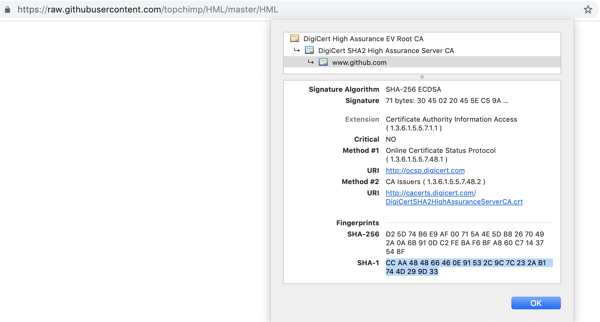

# HML HTTP(s)

This is a quick way of making an HTTP request and using the value returned to changed the dial based on a High/Medium/Low (HML) value.

## HTTPS
If you are using HTTPS(and you should) make sure you get the SHA-1 of the certificate for the site you are making a request to.
e.g. click on the padlock in the browser

Grab the highlighted bit and change the 'fingerprint' variable to match. If you don't the connect will fail because it doesn't match what is expected!

