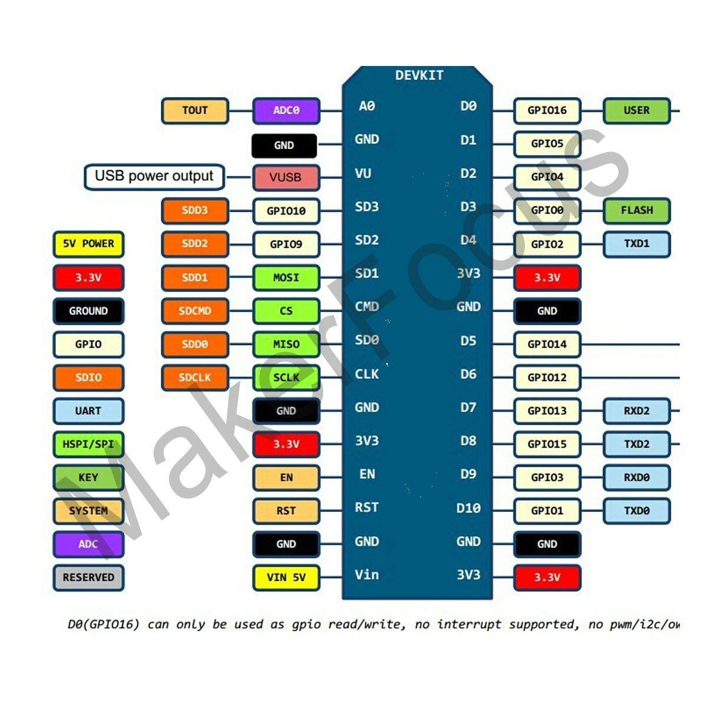

# iotDial

This is the repo to support the LOD hack lab to build an IoT dial.

WARNINGS: This is dirty work!

What bits do I need?
* Servo motor - try [Adafruit Servos](https://www.adafruit.com/product/169)
* ESP8266 board mine are just cheap generic ones bought via Amazon
* A cardboard box
* A pointer thingy
* Some jumper cables

We'll drive a servo motor using the 3 pinouts 3V3, GND and D5 

## Install these
Arduino [Arduino - MacOSX](https://www.arduino.cc/en/guide/MacOSX)

There's a more detailed guide [here](https://learn.adafruit.com/adafruit-huzzah-esp8266-breakout/using-arduino-ide)

USB driver
[USB to UART Bridge VCP Drivers - Silicon Labs](https://www.silabs.com/products/development-tools/software/usb-to-uart-bridge-vcp-drivers)

## Template to print your own dial
Template
https://docs.google.com/drawings/d/1FsJtjDKRaOuEkRzTHfADfxqkPdxaVza58anfTz26WXo/edit

## Parts list
* ESP8266 compatible board
* Servo like this https://www.adafruit.com/product/169
* USB cable
* M/F cables to connect ythe servo

Optional
* Project box
* Battery

## Guide to the Projects
* ABC - A simple 3 position move for the servo (think Low, Medium and High)
* Wave - flips between 0 and 180 degrees every 10 seconds

## Using the generic HiLetgo ESP8266's e.g. MakerHawk

ESP8266 is a highly integrated chip designed for the needs of a new connected world. It offers a complete and self-contained Wi-Fi networking solution, allowing it to either host the application or to offload all Wi-Fi networking functions from another application processor. 
Instruction & Steps of How to use:
1. Download the Arduino IDE, the latest version. 
2. Install the IDE
3. Set up your Arduino IDE as:
Go to File->Preferences and copy the URL below to get the ESP board manager extensions: arduino.esp8266.com/stable/package_esp8266com_index.json
4. Go to Tools > Board > Board Manager> Type "esp8266" and download the Community esp8266 and install. 
5. Set up your chip as:
Tools -> Board -> NodeMCU 1.0 (ESP-12E Module)
Tools -> Flash Size -> 4M (3M SPIFFS)
Tools -> CPU Frequency -> 80 Mhz
Tools -> Upload Speed -> 921600

### Pinouts

* 3v3 
* GND
* D5

## Using the MakerHawk ESP8266s
Here's a picture of the MakerHawk. Underneath it is black with a large white wifi logo

* 3v3 
* GND
* D5

IDE Settings for makerhawk (it seems to like a strange port!)

## Arduino support for IntelliJ
[Arduino Support - Plugins | JetBrains](https://plugins.jetbrains.com/plugin/11301-arduino-support)
Then plugins> settings > install from disk
Use the zip
Restart Intellij
Cmd-shift-a Arduino support >on

Our use platform.io

## FAQ
How do I do debugging?
Tools>Serial Monitor 
Serial.println()
